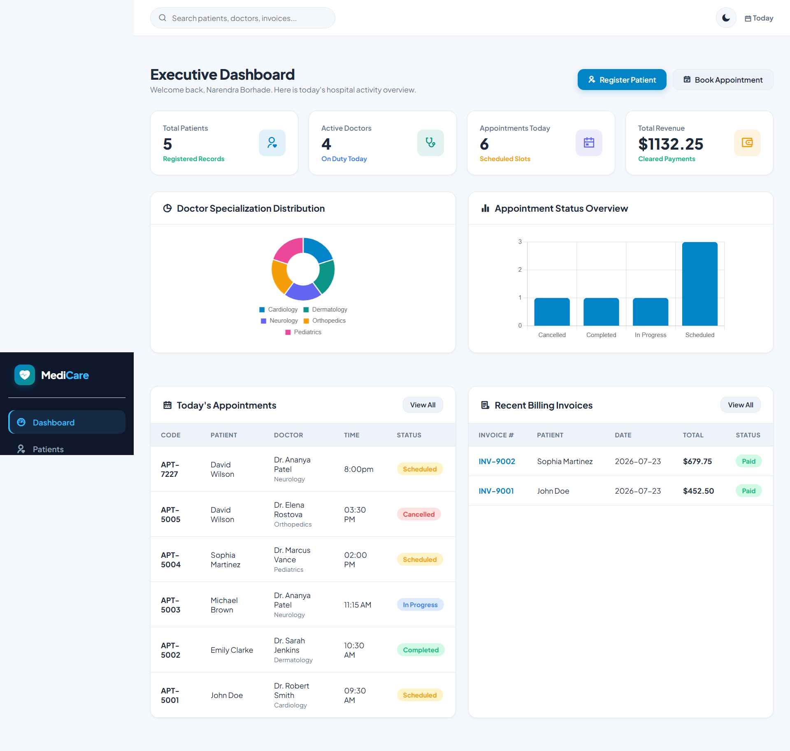

# 🏥 Medicare - Hospital Management System 🏥

<p align="center">
  
</p>

<p align="center">
  <em>A modern, responsive, and feature-rich Hospital Management System built with Flask and SQLite.</em>
</p>

<p align="center">
  
  
  
  
</p>

---

## ✨ Features

- **👤 Role-Based Authentication:** Secure login for `Admins`, `Doctors`, and `Patients`.
- **📊 Admin Dashboard:** A comprehensive overview of hospital statistics, recent activities, and financial summaries.
- **🩺 Patient Management:** Complete electronic health records (EHR), including demographics, medical history, and appointments.
- **👨‍⚕️ Doctor Profiles:** Manage doctor specializations, schedules, and availability.
- **🗓️ Appointment Scheduling:** Easy-to-use interface for booking, managing, and tracking patient appointments.
- **💊 E-Prescriptions:** Create and manage digital prescriptions linked to patient records.
- **💳 Billing & Invoicing:** Generate detailed invoices, track payments, and manage financial data.
- **🔍 Global Search:** Instantly find patients, doctors, appointments, or invoices.
- **📈 Analytics API:** Endpoints for visualizing data, such as department-wise doctor distribution.
- **📱 Responsive UI:** A clean and modern user interface that works on all devices.

---

## 🚀 Technology Stack

- **Backend:** `Python` with `Flask`
- **Database:** `SQLite`
- **Frontend:** `HTML5`, `CSS3`, `JavaScript`
- **UI Framework:** `Bootstrap` (implied from the design)
- **PDF Generation:** `fpdf2`

---

## ⚙️ Getting Started

Follow these instructions to set up and run the project on your local machine.

### Prerequisites

- Python 3.7+
- `pip` for package management

### Installation

1.  **Clone the repository:**
    ```bash
    git clone https://github.com/your-username/hospital-management-system.git
    cd hospital-management-system
    ```

2.  **Create a virtual environment (recommended):**
    ```bash
    # For Windows
    python -m venv venv
    venv\Scripts\activate

    # For macOS/Linux
    python3 -m venv venv
    source venv/bin/activate
    ```

3.  **Install the dependencies:**
    ```bash
    pip install -r requirements.txt
    ```

### Running the Application

1.  **Initialize the database:**
    The database `hospital.db` is created automatically, and sample data is seeded the first time you run the app.

2.  **Run the Flask development server:**
    ```bash
    python app.py
    ```

3.  **Access the application:**
    Open your web browser and navigate to `http://127.0.0.1:5000`

### 🔑 Default Login Credentials

You can use the following credentials to log in and test the application:

- **Admin:**
  - **Username:** `admin`
  - **Password:** `admin123`
- **Doctor:**
  - **Username:** `dr_smith`
  - **Password:** `doc123`
- **Patient:**
  - **Username:** `john_doe`
  - **Password:** `user123`

---

## 🖼️ Screenshots

| Dashboard | Appointments |
| :---: | :---: |
|  |  |

| Billing | Patient History |
| :---: | :---: |
|  |  |

---

## 📁 Project Structure

```
hospital-management-system/
│
├── app.py              # Main Flask application file
├── database.py         # Database initialization and schema
├── requirements.txt    # Python dependencies
├── hospital.db         # SQLite database file
│
├── static/             # Static assets
│   ├── css/
│   └── js/
│
├── templates/          # HTML templates
│   ├── base.html
│   ├── login.html
│   └── ... (other pages)
│
└── Images/             # Application screenshots
```

---

## 🤝 Contributing

Contributions are welcome! If you have ideas for improvements or find any bugs, feel free to open an issue or submit a pull request.

1.  Fork the Project
2.  Create your Feature Branch (`git checkout -b feature/AmazingFeature`)
3.  Commit your Changes (`git commit -m 'Add some AmazingFeature'`)
4.  Push to the Branch (`git push origin feature/AmazingFeature`)
5.  Open a Pull Request

---

## 📜 License

This project is licensed under the MIT License. See the `LICENSE` file for more details.

---

<p align="center">
  Made with ❤️ by [Your Name]
</p>
