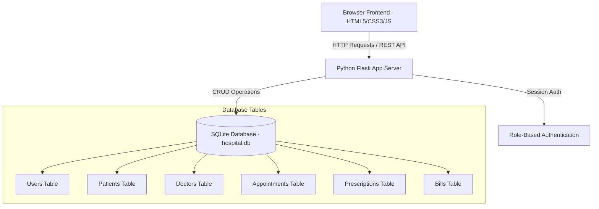

# 🏥 MediCare Hospital Management System (HMS) - Technical Documentation & System Guide

## Executive Summary

**MediCare HMS** is a full-stack, enterprise-grade Hospital Management System engineered with **Python (Flask)**, **SQLite**, **HTML5**, **Vanilla CSS3**, and **JavaScript (ES6+)**. It streamlines hospital operations including patient onboarding, specialist scheduling, appointment queues, prescription tracking, itemized billing, and executive analytics.

---

## 📸 System Module Walkthrough & Screenshots

### 1. Executive Dashboard & Real-Time Analytics
The homepage features high-level metric cards, interactive Chart.js visualizations (Department distribution & Appointment status queue), quick navigation shortcuts, and recent transaction tables.


> [!NOTE]
> **Key Metrics Tracked**: Total Registered Patients, Active Doctors on Duty, Today's Scheduled Appointments, and Total Cleared Revenue.

---

### 2. Patient Records Management
Comprehensive patient directory with instant live search/filtering, demographic breakdowns (Age, Gender, Blood Group), emergency contacts, and direct links to full patient medical history timelines.


---

### 3. Doctor Specialists & Availability Schedules
Directory of medical specialists featuring qualifications, experience years, consultation fees, weekly shift availability, and a real-time status toggle (`Active` / `On Leave`).


---

### 4. Appointment Booking & Queue System
Real-time appointment scheduling connecting registered patients with active doctors. Supports status updates (`Scheduled` ➔ `In Progress` ➔ `Completed` ➔ `Cancelled`).


---

### 5. Prescriptions & Medication Management
Digital prescription creation containing clinical diagnoses, attending doctor details, dietary advice, and itemized medication rows (Drug Name, Dosage, Frequency, and Duration).


---

### 6. Billing & Patient Invoicing System
Hospital invoice management supporting itemized line charges (Consultations, Tests, Room Fees), tax rates, discounts, payment status tracking (`Paid` / `Pending`), and clean printable invoices (`@media print`).


---

## 🏗️ Architecture & Technology Stack



### Stack Breakdown:
- **Backend Framework**: Python 3.14 + Flask 3.0
- **Database**: SQLite3 (`hospital.db` with auto-seeding engine)
- **Frontend Styling**: CSS3 Custom Properties (Variables), Dark/Light theme modes, Flexbox/Grid layouts, Glassmorphism card effects
- **Dynamic UX**: ES6 JavaScript, Chart.js for analytics, RemixIcon vector icon set

---

## 🗄️ Database Schema & Entities

| Table | Primary Key | Description & Key Columns |
| :--- | :--- | :--- |
| `users` | `id` | System credentials (`username`, `password`, `role`: `admin`/`doctor`/`patient`) |
| `patients` | `id` | Patient info (`patient_code`, `name`, `age`, `gender`, `blood_group`, `phone`, `emergency_contact`, `medical_history`) |
| `doctors` | `id` | Doctor profiles (`doctor_code`, `name`, `specialization`, `qualification`, `experience_years`, `consultation_fee`, `availability`, `status`) |
| `appointments` | `id` | Appointment queue (`appointment_code`, `patient_id`, `doctor_id`, `appointment_date`, `appointment_time`, `reason`, `status`) |
| `prescriptions` | `id` | Prescriptions (`appointment_id`, `patient_id`, `doctor_id`, `diagnosis`, `medicines_json`, `advice`) |
| `bills` | `id` | Invoices (`invoice_number`, `patient_id`, `bill_date`, `items_json`, `subtotal`, `tax`, `discount`, `total_amount`, `payment_status`, `payment_method`) |

---

## 🔑 Quick Demo Credentials

| Role | Username | Password | Purpose |
| :--- | :--- | :--- | :--- |
| **Admin** | `admin` | `admin123` | Full Administrative & System Access |
| **Doctor** | `dr_smith` | `doc123` | Doctor Consultation & Prescriptions |
| **Patient** | `john_doe` | `user123` | Personal Medical Records & Invoices |

---

## 💻 How to Run the Application

1. Open PowerShell or Terminal in the project directory:
   ```bash
   cd C:\My Stuff\hospital_management_system
   ```
2. Launch the Flask application:
   ```bash
   python app.py
   ```
3. Open your browser and navigate to:
   **[http://127.0.0.1:5000](http://127.0.0.1:5000)**
